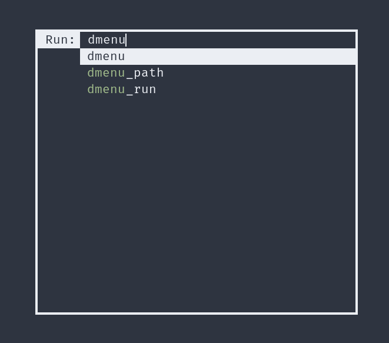

# dmenu

This is my personal build of dmenu, with a couple of patches applied.
Install it like you would regular dmenu.
It has a nord theme, matching character highlighting, centers itself on the screen and has a border.

## Scripts

Some of my personal scripts use dmenu:
[Here](https://github.com/sandalbanditten/scripts) they are!

## Pacthes

Here are the patches I use:
* [center](https://tools.suckless.org/dmenu/patches/center/)
* [border](https://tools.suckless.org/dmenu/patches/border/)
* [line-height](https://tools.suckless.org/dmenu/patches/line-height/)
* [highlight](https://tools.suckless.org/dmenu/patches/highlight/)

## Screenshot

Here is a screenshot of my dmenu_run:

## License
The MIT/X Consortium License
